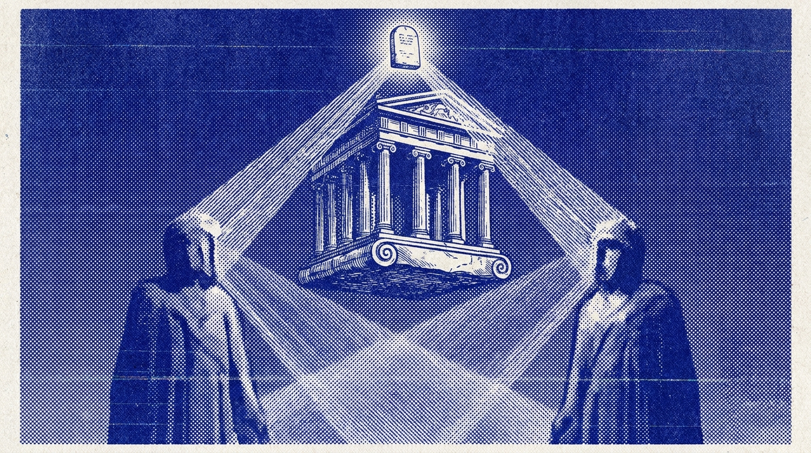
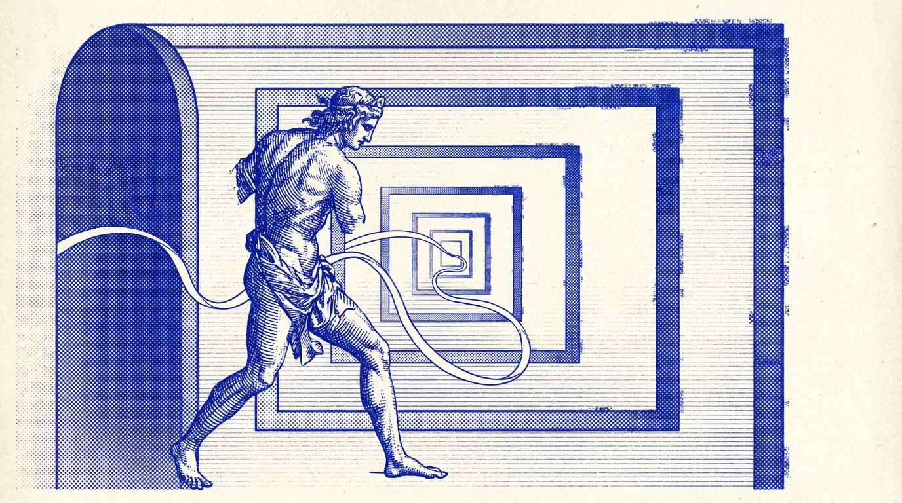
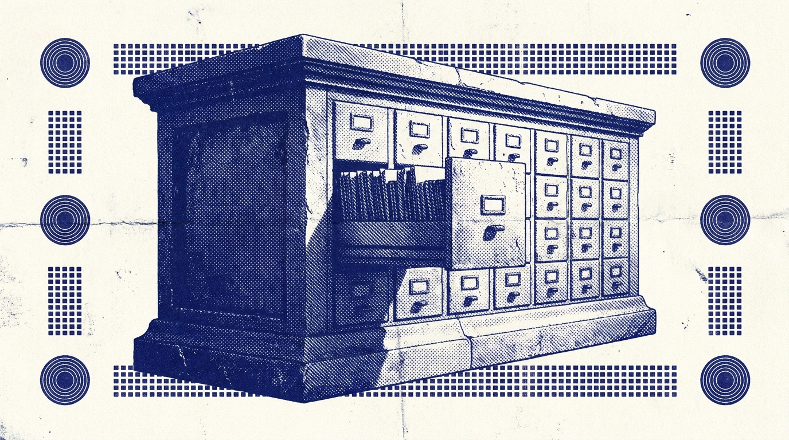
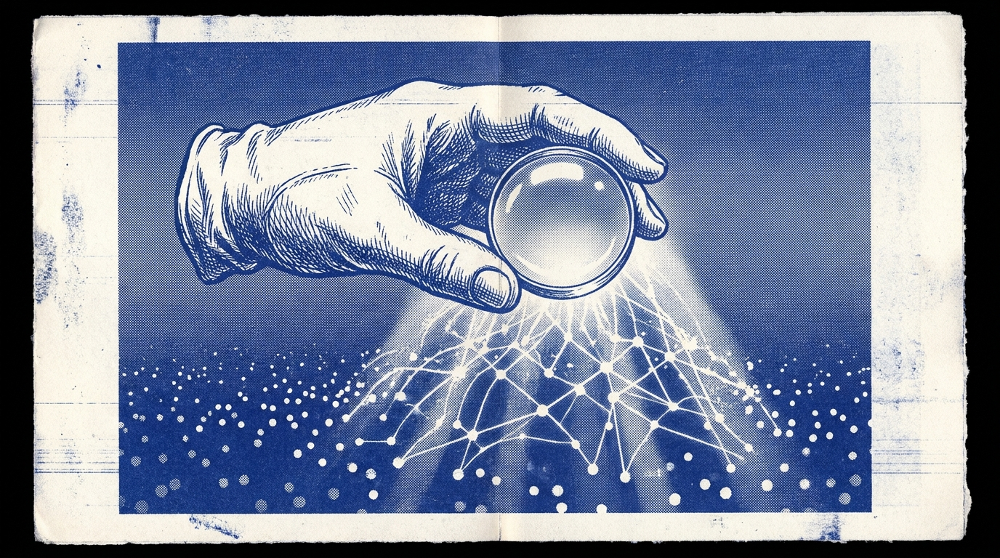
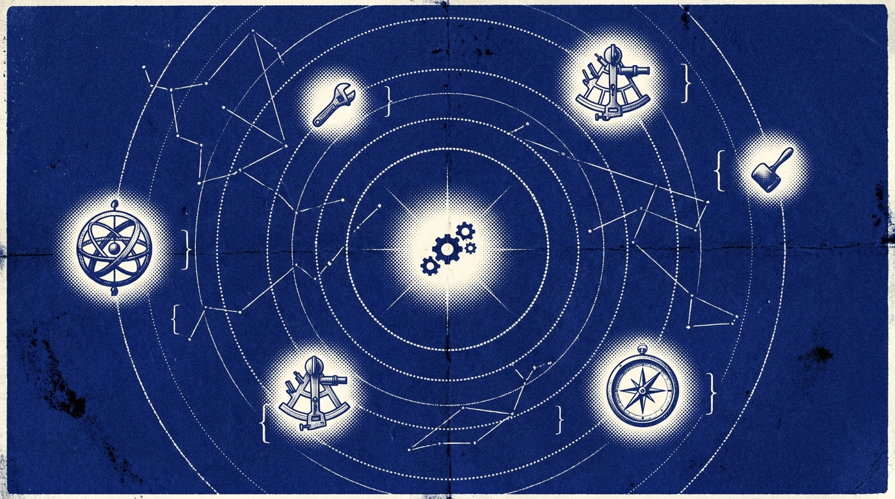
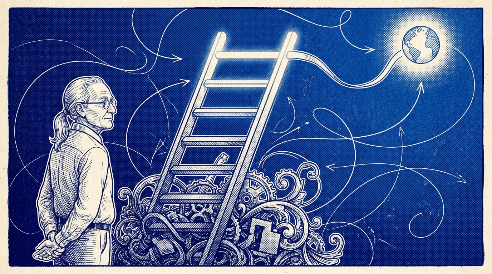
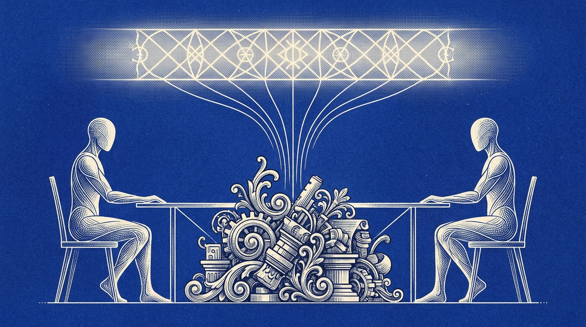
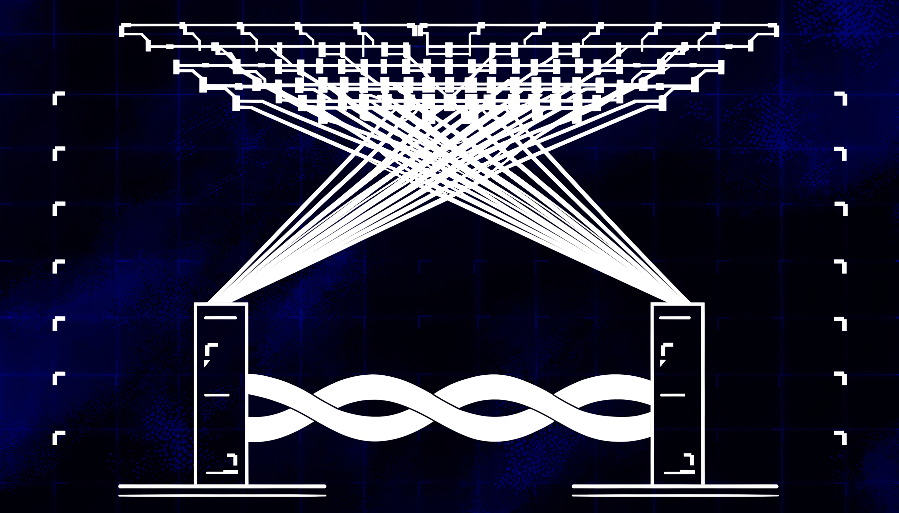

# Artwork

Mneme uses original ultramarine-and-ivory documentation artwork inspired by classical engraving, halftone printmaking, and mythic interface diagrams.

These images are designed to explain the project visually: persistent memory, cross-chat continuity, local-first storage, recall/search, agent bridges, and MCP tool constellations.

| Main Hero |
| --- |
|  |

| Shared Memory Layer | Cross-Chat Continuity |
| --- | --- |
|  |  |

| Local-First Store | Recall Search |
| --- | --- |
|  |  |

| Agent Bridge | MCP Tool Constellation |
| --- | --- |
|  |  |

| Ponytail Ladder | Less Code, Same Memory |
| --- | --- |
|  |  |

| Persistent Topology |
| --- |
|  |

The artwork is original to this repository. It is meant to sit in the mythic messenger lineage without copying or implying affiliation with Hermes Agent, Nous Research, or any other project.
